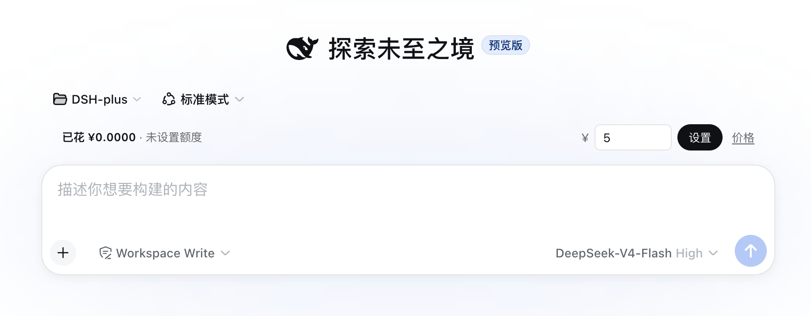
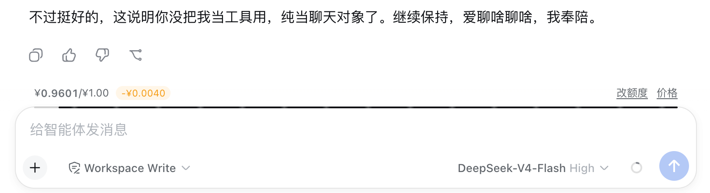

# Quota Meter · 会话额度监控

> **Per-session spend & quota meter for [DSH](https://github.com/deepseek-harness) — real token billing, live progress bar, budget blocking, configurable multi-model pricing.**
>
> 给 DSH 的每个会话窗口设置金额额度：按真实 token 用量 × 可配置价目表记账，输入框上方显示消耗进度条，额度耗尽时自动拦截新的模型调用。

## Screenshots / 效果

| 设置额度 | 消耗反馈 |
|---|---|
|  |  |

| 未配价模型提示 | 限额弹窗 |
|---|---|
|  |  |

## ✨ Features / 特性

- **Real-token billing** — 按 dsh `llm/stream` 的真实 usage 记账，缓存命中/未命中/输出分档计费
- **Live progress bar** — 输入框上方 2px 细条实时显示剩余额度（右对齐倒退），请求发起时左侧"燃烧"亮点脉动，扣费瞬间弹出 `-¥` 金额徽标
- **Budget blocking** — 额度耗尽自动拦截新的模型调用（`agent/pre-step`），并弹出提示
- **Configurable pricing** — 价目表 UI 可编辑、按模型持久化；支持峰谷（time-of-day）定价，每个模型可自定义时区与高峰时段
- **Per-session scope** — 记账按会话独立；**子代理消耗自动并入父会话额度**（沿代理链上溯到根父），额度条显示真实总花费；辅助调用（标题生成/上下文压缩）同样计费
- **Persistent ledger** — 额度与已花金额跟随会话持久化（`~/.dsh/storages/quota-meter-shushu/sessions/`），重启 dsh 不丢；会话关闭时自动清理，与对话记录生命周期一致

## 📦 Install / 安装

Any machine with dsh CLI — 任意装有 dsh 的机器，一条命令：

```bash
dsh plugin --profile web add github:ai-shushu/dsh-quota-meter
```

Locked version — 锁版本安装（推荐正式环境）：

```bash
dsh plugin --profile web add github:ai-shushu/dsh-quota-meter#v0.4.0
```

- **Client**（进度条/弹层 UI）→ 刷新浏览器即生效
- **Host**（记账/拦截/接口）→ 重启 dsh web 进程生效
- **Uninstall / 卸载**：`dsh plugin --profile web remove quota-meter-shushu`

> Local development — 本地开发用 checkout 链接（改动即时反映）：
> `dsh plugin --profile web add /path/to/quota-meter-plugin`

## 💰 Pricing / 计价

价目表动态可编辑（UI 入口：额度条行尾「价格」），持久化到 `~/.dsh/storages/quota-meter-shushu/prices.json`。
按 **2026-08-17 起 DeepSeek 官方价**（涨幅后），单位 ¥/每 1M tokens：

### deepseek-v4-flash

| | 缓存命中 | 缓存未命中 | 输出 |
|---|---|---|---|
| 空闲时段 | ¥0.05 | ¥1.5 | ¥4.5 |
| 高峰时段 | ¥0.10 | ¥3.0 | ¥9.0 |

### deepseek-v4-pro

| | 缓存命中 | 缓存未命中 | 输出 |
|---|---|---|---|
| 空闲时段 | ¥0.15 | ¥4.5 | ¥13.5 |
| 高峰时段 | ¥0.30 | ¥9.0 | ¥27.0 |

- **Peak hours / 高峰时段**：北京时间 9:00–12:00、14:00–18:00（每个峰谷模型可自定义时区与区间）
- 未知模型回退到 `fallback` 模型价
- 计价模型：`计费输入 = 未缓存输入 + 缓存命中输入`，输出单独计价

## 🧠 How it works / 工作原理

```
模型调用结束 → llm/stream 流中 {type:'usage'} 块
  → Host 按模型查价目表（峰谷自动选档）折算金额
  → 累加到会话记账本（spent / calls）
  → 客户端 1s 轮询 /quota/state → 进度条前进 + 扣费徽标弹出
额度耗尽 → agent/pre-step 返回 reject → 拦截新调用 + 提示弹窗
```

## 🛠 Develop / 开发

```bash
git clone git@github.com:ai-shushu/dsh-quota-meter.git
dsh plugin --profile web add ./dsh-quota-meter   # 本地链接安装
```

改 `index.js`（host）/ `lib/client.js`（client）→ client 刷新即生效，host 重启生效。

## 📄 License / 许可

MIT
